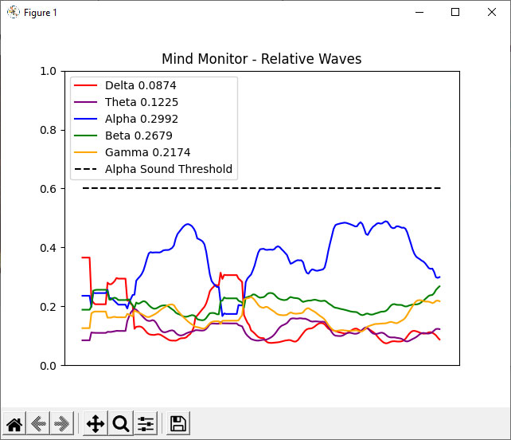

# Mind Monitor Python OSC Samples
Mind Monitor OSC Streaming Python Samples

These code samples are to demonstrate streaming live OSC brainwave data from Mind Monitor (connected to a Muse device), to a computer, which can then process and work with the brainwave data.

## [OSC Receiver Audio Feedback.py](OSC%20Receiver%20Audio%20Feedback.py)

* Calculates and graphs the relative waves.
* Plays a sound file if Alpha relative reaches a pre-set threshold.

## [OSC Receiver Simple.py](OSC%20Receiver%20Simple.py)
* Displays RAW EEG.

## [OSC Receiver.py](OSC%20Receiver.py)
* Records RAW EEG to a CSV file.
* Marker #1 starts recording. Marker #2 stops recording.